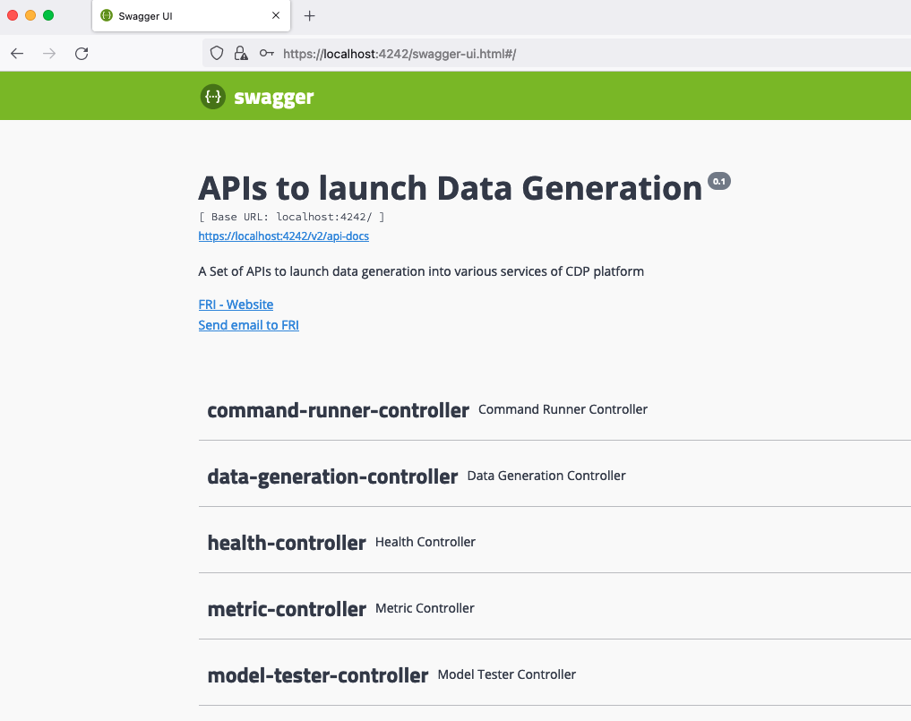

# Installation from source code

It is possible also for development, test purposes to create and deploy the Datagen service from the code.

## Setup the project

First, clone the Git project located here: [https://github.com/frischHWC/datagen](https://github.com/frischHWC/datagen) 

Then create your own branch: 

```shell
git clone https://github.com/frischHWC/datagen
cd datagen
git checkout -b my-branch
```

You can then develop, change the code, the configuration etc... and deploy this local version to any cluster.

You must just push your changes to your git branch.

It is advises that you have your own git repository be either doing a fork directly on github or adding an internal repository.


## Run locally

Before pushing the new code to Cloudera Manager, you can run and test locally.

You can either: 

* Import the project to your favorite IDE and run it from their, (IntelliJ comes with a start command for spring boot java project)
* Run it using command line with: `java -Dnashorn.args=--no-deprecation-warning --add-opens java.base/jdk.internal.ref=ALL-UNNAMED -jar target/DATAGEN*.jar` 

You can then access the Swagger UI on: https://localhost:4242/swagger-ui.html 



All configurations are taken from _application.properties_ file under _src/main/resources/_.

You can specify another properties file by adding this in your command line:

`--spring.config.location=file:/tmp/myconfig-file.properties`


