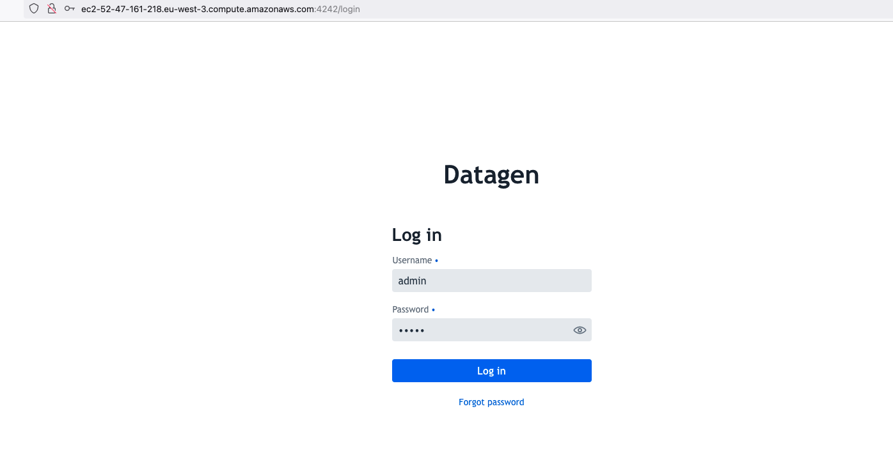
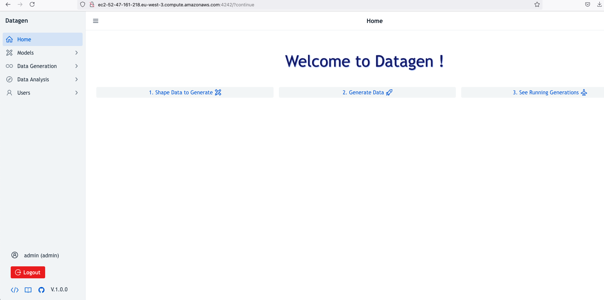

# EC-2: Free-Tier

## Provision

**This is one is using free-tier, hence free machines on AWS but with limited resources**

In AWS > EC 2 > Launch Instance and choose these settings:

- _Type:_ AWS Linux 2023 type
- _Size:_ t2.micro
- _Key Pair:_ Yours
- _Security Group:_ Allowing ssh from your IP
- _Volume:_ 30GB

_Important: Once launched, add in security groups the following port: **4242** as Custom TCP to your IP_

_Note: It is possible to use non-free-tier machines with better power (cpu/memory especially)_
_Note: It is possible to use other OS, as long as Java 17 can be installed, this is just an example_

## Installation

Then ssh to it (using its public name and _ec2-user_) and follow these steps:

**1.** Install Java : 
 
```shell
sudo yum -y install java-17-amazon-corretto
```

**2.** Download & extract Datagen: 

```shell
 wget https://datagen-repo.s3.eu-west-3.amazonaws.com/1.0.0/standalone/datagen-standalone-files.tar.gz 
 tar -xvzf datagen-standalone-files.tar.gz
 cd datagen_standalone-1.0.0/
 ```

**3.** Launch it:

```shell
./launch.sh \
  --min-mem=512M \
  --max-mem=1G \
  --log-dir=/tmp/datagen/ \
  --load-default-models=false
```

## Access

Access UI using: http as protocol, the full hostname of PUBLIC (found as Public IPv4 DNS) and port 4242
as an example: ``http://ec2-51-44-11-41.eu-west-3.compute.amazonaws.com:4242``

Use _admin/admin_ as user/password to connect and start to generate data:

  

  


## Custom Configuration

Later to launch it in background process, add option: `--launch-with-nohup=true`, for example:
  
```shell
./launch.sh \
  --min-mem=512M \
  --max-mem=1G \
  --log-dir=/tmp/datagen/\
  --load-default-models=false \
  --launch-with-nohup=true
```

