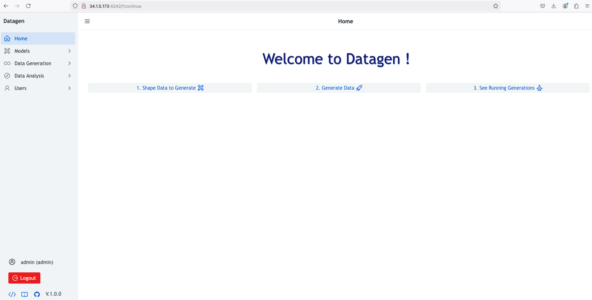

# Compute Engine - VM Instance

## Provision


In GCP > Compute Engine > VM Instances > Launch Instance and choose these settings:

- _Machine Configuration:_ E2 > e2-micro
- _Boot Disk:_ Debian GNU/Linux 12 (bookworm)  
- _Volume:_ Default of 10GB

_Important: You must have ssh enabled to this machine, either through browser-ssh, gcloud, ssh with OS logins or metadata keys_
_Important: You must have a firewall rules to allow connection from your IP as TCP to port **4242** and have it applied to the VM's network, using network tags_

_Note: It is possible to use machines with better power (cpu/memory especially)_
_Note: It is possible to use other OS, as long as Java 17 can be installed, this is just an example_


## Installation

Then ssh to it.

**1.** Install Java : 
 
```shell
sudo apt-get install -y openjdk-17-jre
```

**2.** Download & extract Datagen: 

```shell
 wget https://datagen-repo.s3.eu-west-3.amazonaws.com/1.0.0/standalone/datagen-standalone-files.tar.gz 
 tar -xvzf datagen-standalone-files.tar.gz
 cd datagen_standalone-1.0.0/
 ```

**3.** Launch it:

```shell
./launch.sh \
  --min-mem=512M \
  --max-mem=1G \
  --log-dir=/tmp/datagen/ \
  --load-default-models=false
```

## Access

Access UI using: http as protocol, the full hostname of PUBLIC IP and port 4242
as an example: ``http://34.1.5.173:4242/``

Use _admin/admin_ as user/password to connect and start to generate data:

  


## Custom Configuration

Later to launch it in background process, add option: `--launch-with-nohup=true`, for example:
  
```shell
./launch.sh \
  --min-mem=512M \
  --max-mem=1G \
  --log-dir=/tmp/datagen/\
  --load-default-models=false \
  --launch-with-nohup=true
```