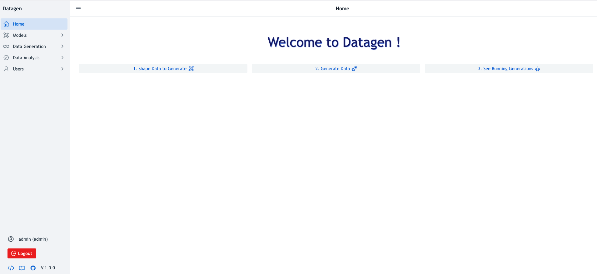
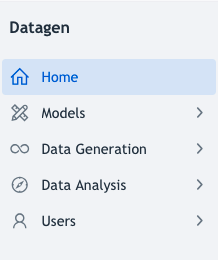
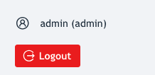
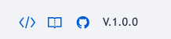

# Prerequisites

Datagen must up and running and available (on port 4242 by default).

Default username/password is **admin/admin** . Unless it is plugged to a distant LDAP.

UI is available by browing URL to port 4242 and should look like this:

_Note: UI is very explicit and contains many explanations, but refer to that detailed documentation in case of doubt_

# Main Menu

Main menu is present on the left and allows user to navigate to different views. (These are detailed in next section)

# Logout

It is possible to logout and see with which user it is authenticated by looking at bottom of left panel.

Below, there is a Logout red button that will redirect to /login page being unauthenticated.

_Role is also displayed in () alongside to the user, it is either: user or admin_

# Links

On left panel, at the bottom, there are 3 links:

- To Swagger URL of this instance
- To Official Documentation
- To Github Repository of Datagen

 