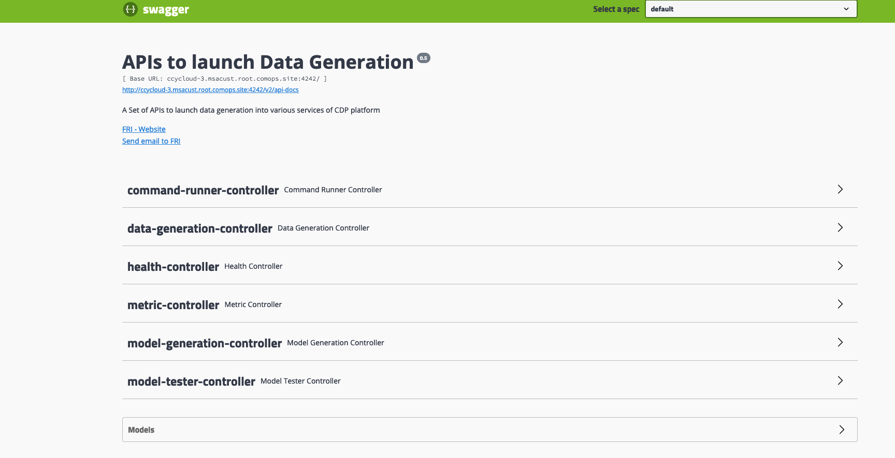

# Prerequisites

Datagen must up and running. 

# How to generate Data ? 

To generate Data, a simple **API call** is required with a **file** explaining what kind of data can be generated, and **parameters** on how much data should be generated.

This file is what is called a **"model"**, Datagen come with pre-built models to show how to create them, but latter goal is to create your own ones.

API can be used and discovered easily thanks to swagger, swagger is exposed on: [http://datagen.hostname:4242/swagger-ui.html](http://datagen.hostname:4242/swagger-ui.html) .

