# Example with CDP

This section provides basic examples of Data Generation within Cloudera Data Platform (CDP).

## Basic Generation 

### HDFS

In Cloudera Manager: 

**Datagen > Actions > Generate 1 Million Customers to HDFS**

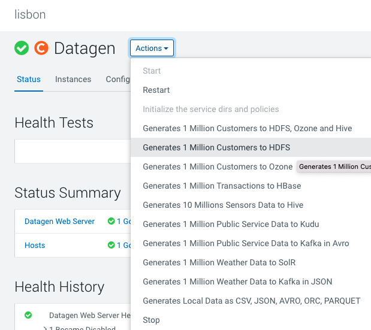

It launches a Cloudera Manager command making different API calls to Datagen Web server to generate data representing customers from different countries.

Output should be:

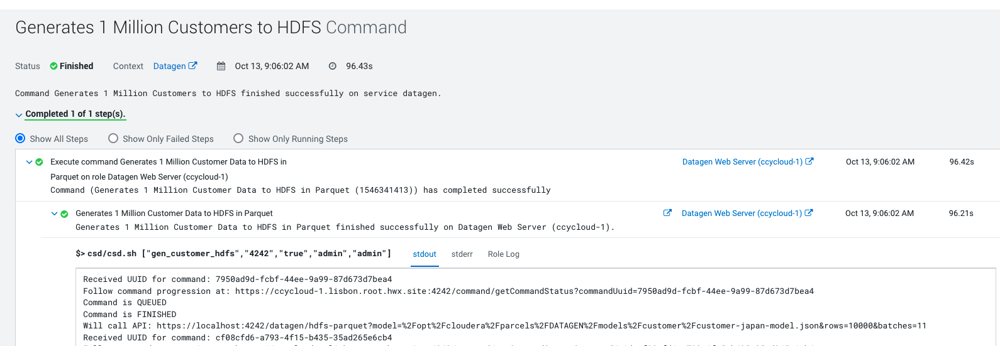

Let's Verify
{: .label .label-green }

In a shell with a logged in user (optionally use datagen ones):

```shell
hdfs dfs -ls /user/datagen/hdfs/customer/
Found 90 items
-rw-r--r--   3 datagen datagen     256024 2022-10-13 09:06 /user/datagen/hdfs/customer/customer-cn-0000000000.parquet
-rw-r--r--   3 datagen datagen     255393 2022-10-13 09:06 /user/datagen/hdfs/customer/customer-cn-0000000001.parquet
-rw-r--r--   3 datagen datagen     255618 2022-10-13 09:06 /user/datagen/hdfs/customer/customer-cn-0000000002.parquet
```


### Hive

In Cloudera Manager: 

**Datagen > Actions > Generate 10 Million Sensors Data to Hive**

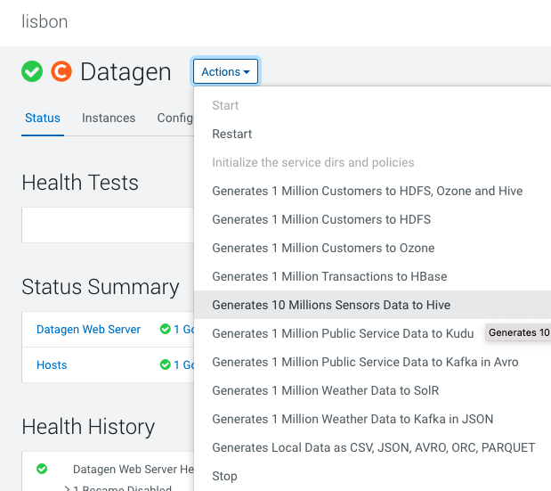

It launches a Cloudera Manager command making different API calls to Datagen Web server to generate data representing sensors data.

Output should be:

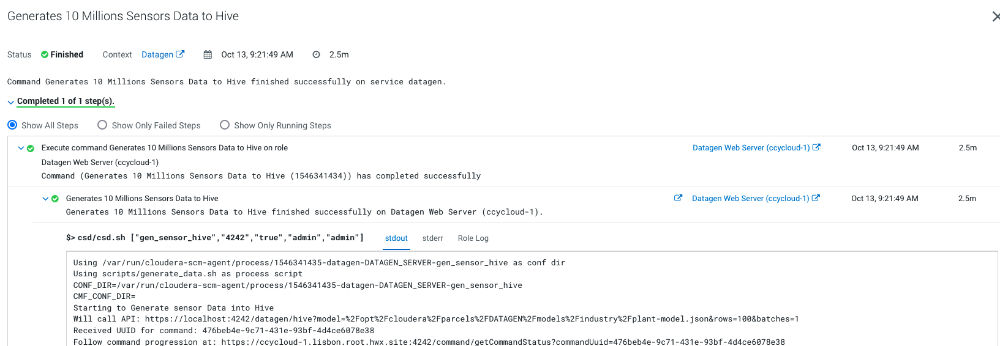

Let's Verify
{: .label .label-green }

In a shell with a logged in user (optionally use datagen ones):

```shell
0: jdbc:hive2://ccycloud-2.lisbon.root.hwx.si> show databases;
...
INFO  : OK
+---------------------+
|    database_name    |
+---------------------+
| datagen_industry    |
| default             |
| information_schema  |
| sys                 |
+---------------------+
0: jdbc:hive2://ccycloud-2.lisbon.root.hwx.si> use datagen_industry;
...
0: jdbc:hive2://ccycloud-2.lisbon.root.hwx.si> show tables;
...
INFO  : OK
+------------------+
|     tab_name     |
+------------------+
| plant            |
| plant_tmp        |
| sensor           |
| sensor_data      |
| sensor_data_tmp  |
| sensor_tmp       |
+------------------+
6 rows selected (0.059 seconds)
0: jdbc:hive2://ccycloud-2.lisbon.root.hwx.si> select * from plant limit 2;
...
INFO  : OK
+-----------------+--------------------+------------+-------------+----------------+
| plant.plant_id  |     plant.city     | plant.lat  | plant.long  | plant.country  |
+-----------------+--------------------+------------+-------------+----------------+
| 1               | Chotebor           | 49,7208    | 15,6702     | Czechia        |
| 2               | Tecpan de Galeana  | 17,25      | -100,6833   | Mexico         |
+-----------------+--------------------+------------+-------------+----------------+
2 rows selected (0.361 seconds)
0: jdbc:hive2://ccycloud-2.lisbon.root.hwx.si> select * from sensor limit 2;
...
INFO  : OK
+-------------------+---------------------+------------------+
| sensor.sensor_id  | sensor.sensor_type  | sensor.plant_id  |
+-------------------+---------------------+------------------+
| 70001             | motion              | 186              |
| 70002             | temperature         | 535              |
+-------------------+---------------------+------------------+
2 rows selected (0.173 seconds)
0: jdbc:hive2://ccycloud-2.lisbon.root.hwx.si> select * from sensor_data limit 2;
...
INFO  : OK
+------------------------+--------------------------------------+----------------------+
| sensor_data.sensor_id  | sensor_data.timestamp_of_production  |  sensor_data.value   |
+------------------------+--------------------------------------+----------------------+
| 88411                  | 1665678228258                        | 1895793134684555135  |
| 52084                  | 1665678228259                        | -621460457255314082  |
+------------------------+--------------------------------------+----------------------+
2 rows selected (0.189 seconds)
```


### Ozone

In Cloudera Manager: 

**Datagen > Actions > Generate 1 Million Customers to Ozone**

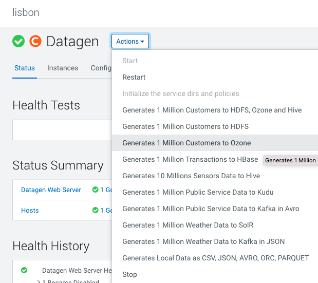

It launches a Cloudera Manager command making different API calls to Datagen Web server to generate data representing customers from different countries.

Output should be:

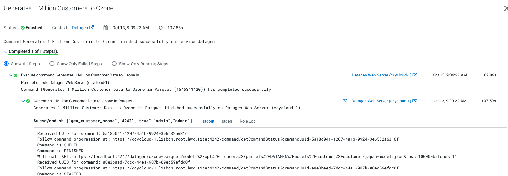

Let's Verify
{: .label .label-green }

In a shell with a logged in user (optionally use datagen ones):

```shell
ozone sh key list datagen/customer
{
  "volumeName" : "datagen",
  "bucketName" : "customer",
  "name" : "customer-cn-0000000000.parquet",
  "dataSize" : 255631,
  "creationTime" : "2022-10-13T16:10:02.286Z",
  "modificationTime" : "2022-10-13T16:10:07.866Z",
  "replicationType" : "RATIS",
  "replicationFactor" : 3
}
{
  "volumeName" : "datagen",
  "bucketName" : "customer",
  "name" : "customer-cn-0000000001.parquet",
  "dataSize" : 255633,
  "creationTime" : "2022-10-13T16:10:08.187Z",
  "modificationTime" : "2022-10-13T16:10:08.314Z",
  "replicationType" : "RATIS",
  "replicationFactor" : 3
}
```

### HBase

In Cloudera Manager: 

**Datagen > Actions > Generate 1 Million Transaction to HBase**

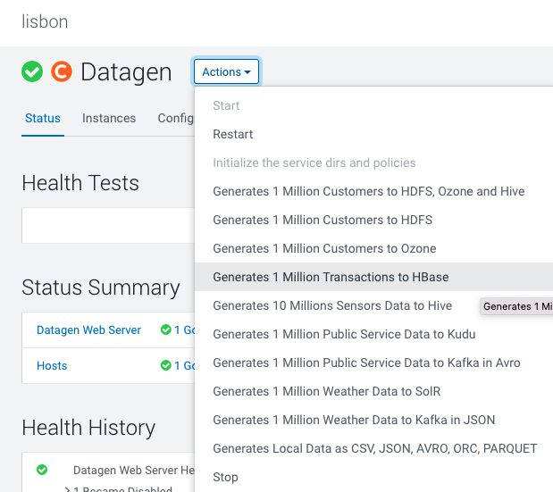

It launches a Cloudera Manager command making different API calls to Datagen Web server to generate data representing transactions.

Output should be:

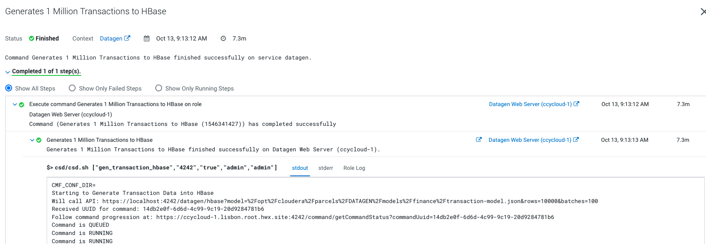

Let's Verify
{: .label .label-green }

In a shell with a logged in user (optionally use datagen ones):

```shell
hbase:001:0> list
TABLE
datagenfinance:transaction
1 row(s)
Took 0.9031 seconds
=> ["datagenfinance:transaction"]
hbase:002:0> count 'datagenfinance:transaction'
Current count: 1000, row: 10223641061665677647491
Current count: 2000, row: 10450220651665677774524
Current count: 3000, row: 10680209721665677628857
Current count: 4000, row: 10909219011665677828439
Current count: 5000, row: 1114021121665677841475
Current count: 6000, row: 11370585341665677806053
```

## Detailed Generation

This section explains what kind of data each data generation button creates.

#### HDFS & Ozone

HDFS & Ozone buttons created 1 million customers from different countries (using the different customer models under _/opt/cloudera/parcels/DATAGEN/models/customer/_) and pushed them in Parquet file.

Sample of data in JSON format:

```json
{ "name" : "Loris", "id" : "790001", "birthdate" : "1987-01-11", "city" : "Stevensville", "country" : "USA", "email" : "Loris@company.us", "phone_number" : "+1 7225688066", "membership" : "SILVER" }
{ "name" : "Marcell", "id" : "490001", "birthdate" : "1950-06-22", "city" : "Pontecorvo", "country" : "Italy", "email" : "Marcell@company.it", "phone_number" : "+39 995887416", "membership" : "BRONZE" }
{ "name" : "Ryong", "id" : "520001", "birthdate" : "1941-02-05", "city" : "Yachiyo", "country" : "Japan", "email" : "Ryong@company.jp", "phone_number" : "+81 809127101", "membership" : "PLATINUM" }
```

#### HBase

HBase button created a 1 million transactions (using the transaction model under _/opt/cloudera/parcels/DATAGEN/models/finance/transaction-model.json_).

Sample of data in JSON format:

```json
{ "sender_id" : "50902", "receiver_id" : "10391", "amount" : "0.8084345", "execution_date" : "1665728236778", "currency" : "EUR" }
{ "sender_id" : "21403", "receiver_id" : "68104", "amount" : "0.65117764", "execution_date" : "1665728285129", "currency" : "USD" }
```


#### Hive

Hive button created a 1 million sensors data (using different models under _/opt/cloudera/parcels/DATAGEN/models/industry/_).

It will generate 100 plants data like this:

```json
{ "plant_id" : "1", "city" : "Bollene", "lat" : "44,2803", "long" : "4,7489", "country" : "France" }
```

It will generate 100 000 sensors like this (each can be linked to a plant):

```json
{ "sensor_id" : "1", "sensor_type" : "humidity", "plant_id" : "690" }
```

It will generate 1 000 000 sensors data like this (each can be linked to a sensor):

```json
{ "sensor_id" : "58764", "timestamp_of_production" : "1665728724586", "value" : "-3000244563995128335" }
```


### Local files 

In Cloudera Manager: 

**Datagen > Actions > Generate Local data as CSV, JSON, AVRO, ORC, PARQUET**

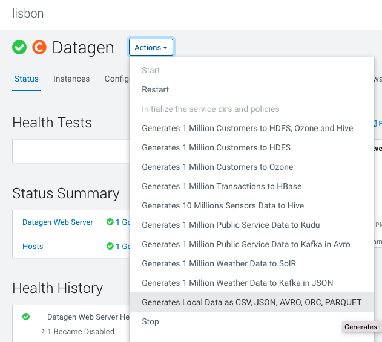

It launches a Cloudera Manager command making different API calls to Datagen Web server to generate multiple data using almost all possible models.

Output should be:

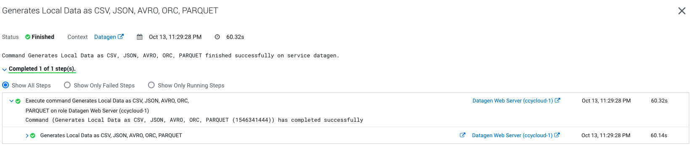

Let's Verify
{: .label .label-green }

In a shell with a logged in user (optionally use datagen ones):

```shell
 cat /home/datagen/customer/customer-fr-0000000000.json
{ "name" : "Josse", "id" : "120001", "birthdate" : "2001-08-03", "city" : "Meylan", "country" : "France", "email" : "Josse@company.fr", "phone_number" : "+33 444585074", "membership" : "BRONZE" }
{ "name" : "Piet", "id" : "120002", "birthdate" : "1970-06-17", "city" : "Bures-sur-Yvette", "country" : "France", "email" : "Piet@company.fr", "phone_number" : "+33 851063627", "membership" : "BRONZE" }
{ "name" : "Armand", "id" : "120003", "birthdate" : "1990-10-04", "city" : "Notre-Dame-de-Gravenchon", "country" : "France", "email" : "Armand@company.fr", "phone_number" : "+33 575158362", "membership" : "BRONZE" }
{ "name" : "Marvin", "id" : "120004", "birthdate" : "1960-10-04", "city" : "Saint-Pryve-Saint-Mesmin", "country" : "France", "email" : "Marvin@company.fr", "phone_number" : "+33 588241506", "membership" : "BRONZE" }
{ "name" : "Vivian", "id" : "120005", "birthdate" : "1994-04-28", "city" : "La Cadiere-d'Azur", "country" : "France", "email" : "Vivian@company.fr", "phone_number" : "+33 553370858", "membership" : "BRONZE" }
{ "name" : "Jakob", "id" : "120006", "birthdate" : "1976-08-02", "city" : "Chaville", "country" : "France", "email" : "Jakob@company.fr", "phone_number" : "+33 208782811", "membership" : "BRONZE" }
{ "name" : "Bo", "id" : "120007", "birthdate" : "1966-10-14", "city" : "Brignoles", "country" : "France", "email" : "Bo@company.fr", "phone_number" : "+33 068739422", "membership" : "PLATINUM" }
{ "name" : "Emilienne", "id" : "120008", "birthdate" : "1976-02-23", "city" : "Orange", "country" : "France", "email" : "Emilienne@company.fr", "phone_number" : "+33 303877991", "membership" : "BRONZE" }
{ "name" : "Elise", "id" : "120009", "birthdate" : "1965-11-28", "city" : "Cosne sur Loire", "country" : "France", "email" : "Elise@company.fr", "phone_number" : "+33 540812701", "membership" : "SILVER" }
{ "name" : "Roelof", "id" : "120010", "birthdate" : "1982-06-01", "city" : "Magny-en-Vexin", "country" : "France", "email" : "Roelof@company.fr", "phone_number" : "+33 252194443", "membership" : "BRONZE" }

cat /home/datagen/finance/transaction/transaction-0000000000.csv

sender_id,receiver_id,amount,execution_date,currency
"11292","27627","0.7721951","1665729006111","USD"
"49294","95851","0.4893235","1665729006111","EUR"
"68670","8844","0.009439588","1665729006111","USD"
"61487","46071","0.22023022","1665729006111","EUR"
"14383","57358","0.07566887","1665729006111","YEN"
"89570","96238","0.35353237","1665729006111","USD"
"66066","69065","0.87496656","1665729006111","USD"
"43894","87454","0.11435127","1665729006111","USD"
"76777","19367","0.06878656","1665729006111","EUR"
"53649","14975","0.9570634","1665729006111","EUR"

ls -R /home/datagen/industry/
/home/datagen/industry/:
plant  sensor  sensor_data

/home/datagen/industry/plant:
plant-0000000000.avro

/home/datagen/industry/sensor:
sensor-0000000000.parquet

/home/datagen/industry/sensor_data:
sensor_data-0000000000.orc
```

### SolR

In Cloudera Manager: 

**Datagen > Actions > Generate 1 Million Weather Data to SolR**

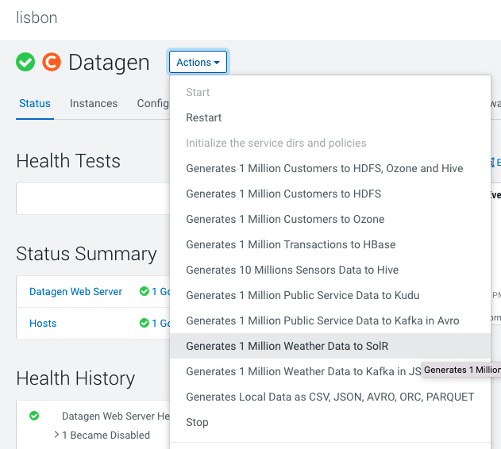

It launches a Cloudera Manager command making different API calls to Datagen Web server to generate multiple data using almost all possible models.

Output should be:

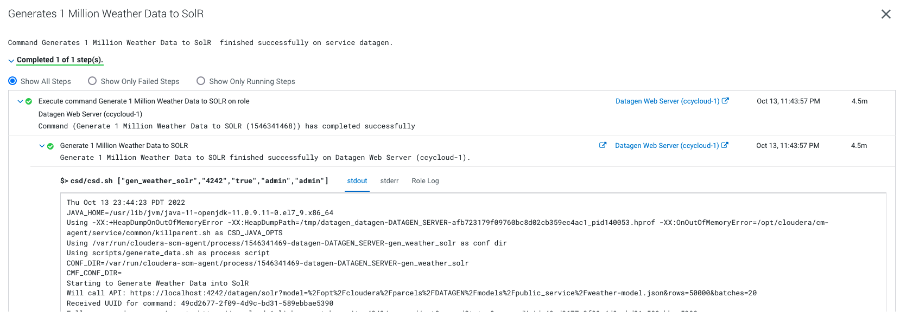


It will generate 1 million weather data like this (using the weather model under _/opt/cloudera/parcels/DATAGEN/models/public_service/weather-model.json_)


```json
{ "city" : "Seysses", "date" : "2021-03-25", "lat" : "43,4981", "long" : "1,3125", "wind_provenance_9_am" : "NORTH", "wind_force_9_am" : "3", "wind_provenance_9_pm" : "WEST", "wind_force_9_pm" : "12", "pressure_9_am" : "1004", "pressure_9_pm" : "1008", "humidity_9_am" : "46", "humidity_9_pm" : "52", "temperature_9_am" : "22", "temperature_9_pm" : "-8", "rain" : "false" }
```


Let's Verify
{: .label .label-green }


Access SolR UI, (login as a user with enough rights):


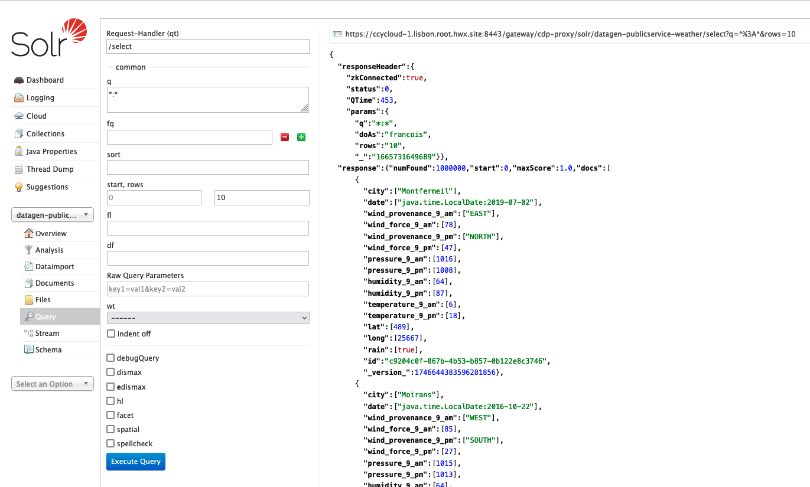


### Kudu


In Cloudera Manager: 

**Datagen > Actions > Generate 1 Million Public Service Data to Kudu**

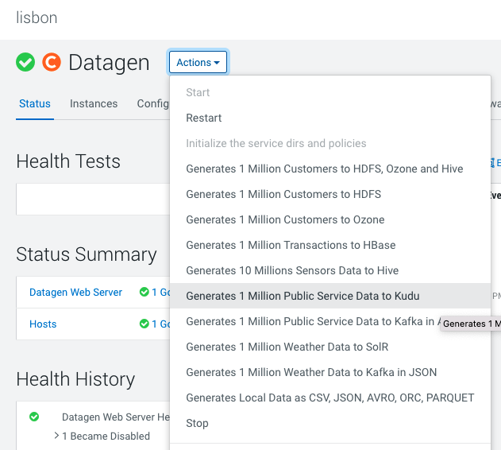

It launches a Cloudera Manager command making different API calls to Datagen Web server to generate multiple data using almost all possible models.

Output should be:

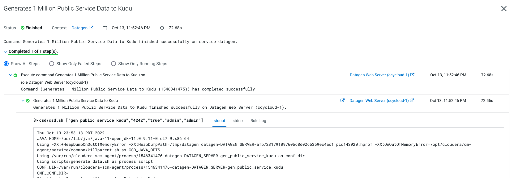


It will generate 1 million weather data like this (using the weather model under _/opt/cloudera/parcels/DATAGEN/models/public_service/incident-model.json_ )


```json
{ "city" : "Le Rove", "lat" : "43,3692", "long" : "5,2503", "reporting_timestamp" : "1665732947892", "emergency" : "URGENT", "type" : "WATER" }
```

Let's Verify
{: .label .label-green }

Go to Hue or an Impala shell and make an INVALIDATE METADATA command to refresh the cache, then you will be able to see in database: _datagen_ a new table _publicservice_incident_ :

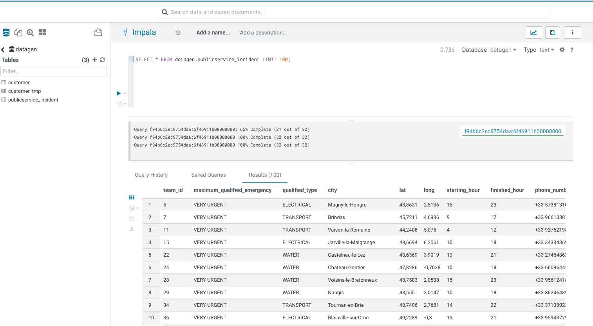


### Kafka

**Datagen > Actions > Generate 1 million weather data to Kafka in JSON OR Public Service Data to Kafka in Avro**

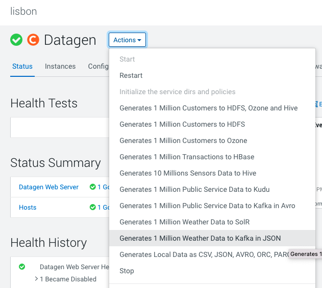

It launches a Cloudera Manager command making different API calls to Datagen Web server to generate multiple data using almost all possible models.

Output should be:

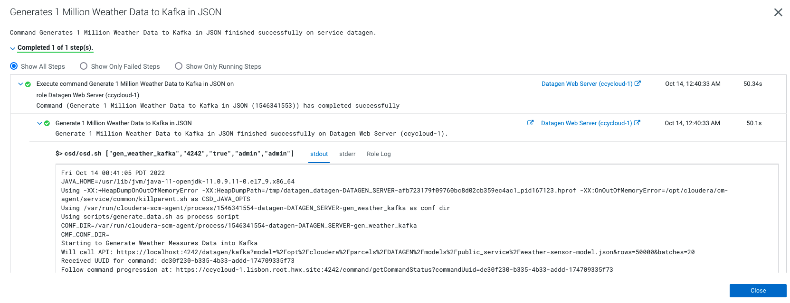


It will generate 1 million weather data like this (using the weather model under _/opt/cloudera/parcels/DATAGEN/models/public_service/weather-model.json_)


```json
{ "city" : "Seysses", "date" : "2021-03-25", "lat" : "43,4981", "long" : "1,3125", "wind_provenance_9_am" : "NORTH", "wind_force_9_am" : "3", "wind_provenance_9_pm" : "WEST", "wind_force_9_pm" : "12", "pressure_9_am" : "1004", "pressure_9_pm" : "1008", "humidity_9_am" : "46", "humidity_9_pm" : "52", "temperature_9_am" : "22", "temperature_9_pm" : "-8", "rain" : "false" }
```

Let's Verify
{: .label .label-green }

You can make a kafka-console-consumer with enough rights and consume the topic from the beginning to verify production of messages.

But we will instead login to Streams Messaging Manager with a user's with enough rights and see data:

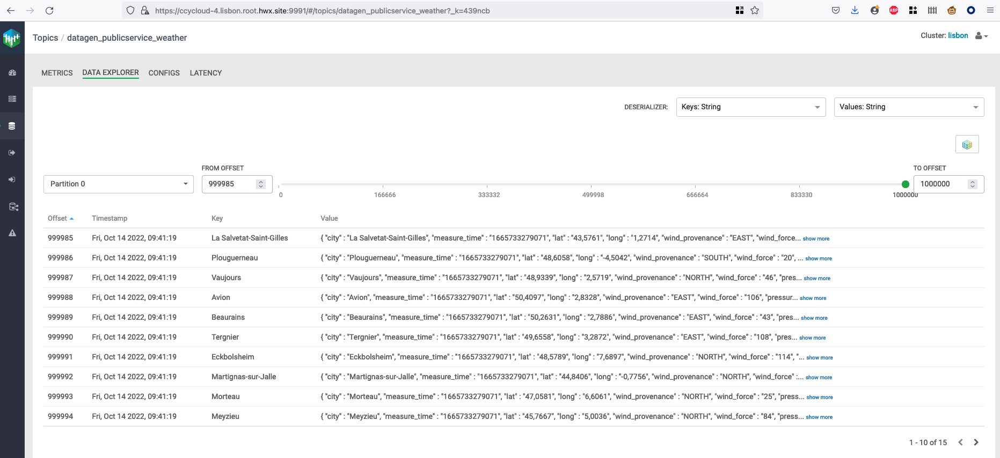


If you picked th data generation with AVRO format, in Streams Messaging Manager:

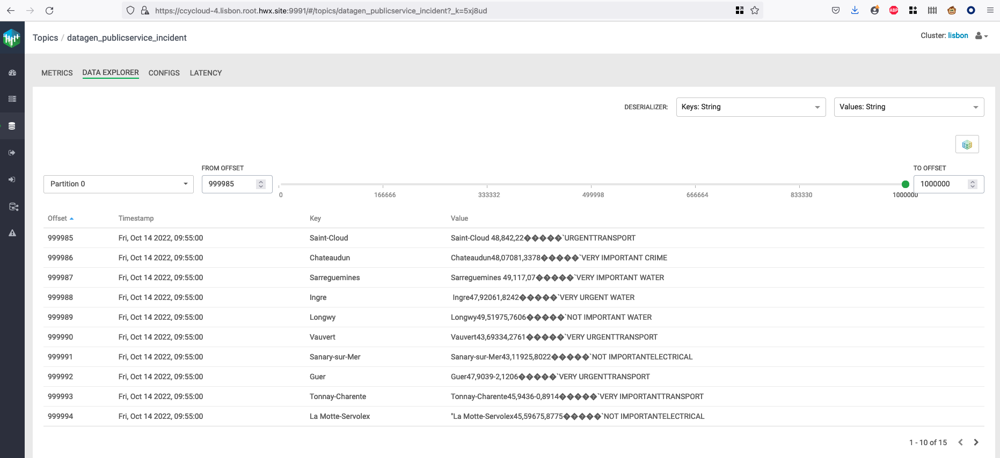


If you picked th data generation with AVRO format, you can go to Schema Registry URL (login with a user's with enough rights) and see the newly added schema:

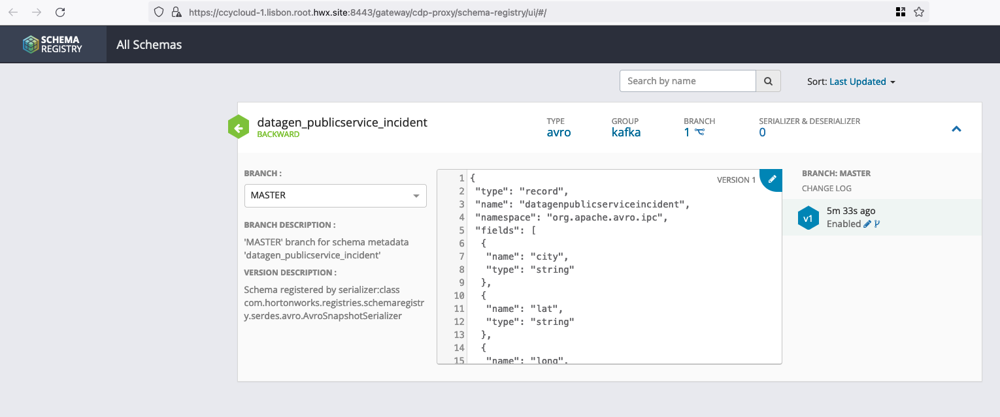


Finally, if you have SQL Stream Builder installed in your cluster, make sure that user's ssb & flink have access rights to generated topic, logged to the web console, upload your keytab if necessary and create the table on kafka topic (in JSON):

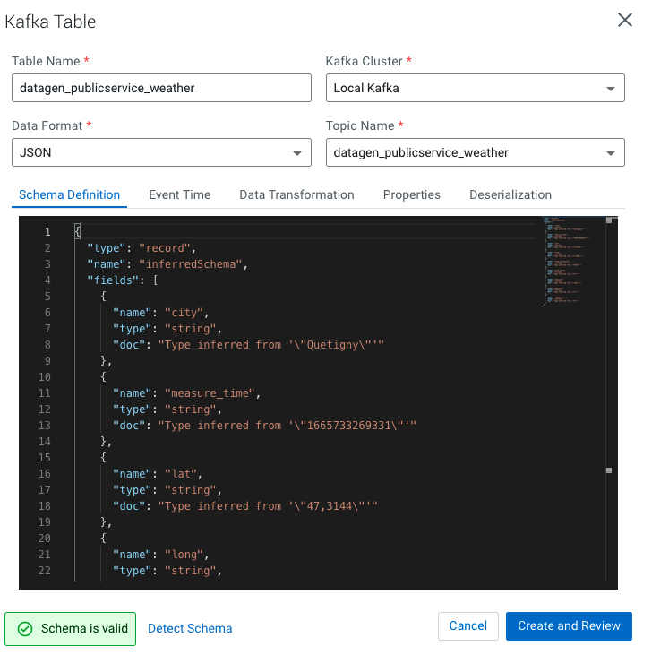

Then do a sample query to visualize data:

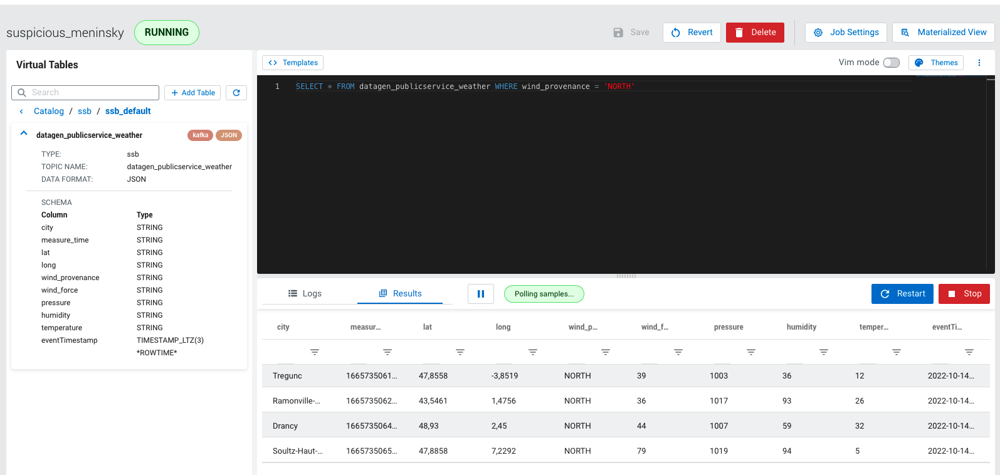


### TROUBLESHOOT

In case of any error, please check the logs through Cloudera Manager or directly on the machine, they are located at _/var/log/datagen/_ .