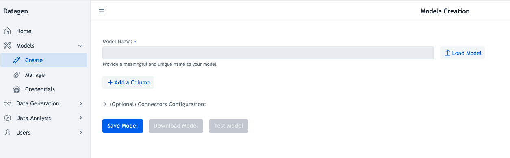

# Model Creation

To create or modify an existing model, click on _Models > Create_ on left panel.

**Model Name**: This field that must be filled and unique.
If it is not, when saving a pop-up will ask to overwrite existing model with same name or not.

**Load Model** button: allows to import an already registered models. 
To register a model, it is done in _Manage_ part.

**Add a Column**: Button used to add as much columns as needed.
A column consists of two mandatory fields at least:
    - Name: Provide a unique name for the column among all columns names of the model
    - Type: Choose among existing types.
Once a column is added, it can also be removed with a _bin_ red button on the right.

_Note: Section on 'Types' details each type and its associated fields to define it._

**(Optional) Connectors Configuration**: is an openable section that is for configuring all type of connectors directly in the model.
Hence it allows the model to hold itself where data will be pushed, otherwise it willbe required to be set at generation.

_Note: Section on 'Connectors' details each connector and its configurable parameters._

**Save Model**: Save model once configured, pops up a confirmation to overwrite if already existing.

**Download Model**: Download the model as a JSON file (it requires to be saved first).

**Test Model**: Test a model by opening a pop-up that presents a row freshly generated in a JSON readable format. 
A re-try command is available to test multiple generations.

