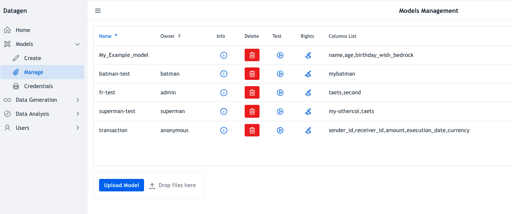

# Manage

To add, list, delete, show or test existing models, click on _Models > Manage_ on left panel.

It prints on main side a table with stored models:

Table consists of following columns:

- **Name** of the model
- **Owner**
- **Info**: Prints the model in a pop-up in JSON format and allows to download it in this format.
- **Delete**: Delete the model (a pop-up ask for deletion)
- **Test**: Provide a freshly generated row
- **Rights** : To see and change (if allowed) the rights setup on a model
- **Columns List**: List columns names of the model

At the bottom of the page, **Upload Model** allows to upload a model in JSON format to Datagen (either by clicking on it or by dropping it on the button).

_Note: Only a Datagen Admin user or its owner or administrator of a model can delete it or change its rights_

_Note:  Only a Datagen Admin user or its owner or administrator of a model or user of a model can test it and get info on it_
