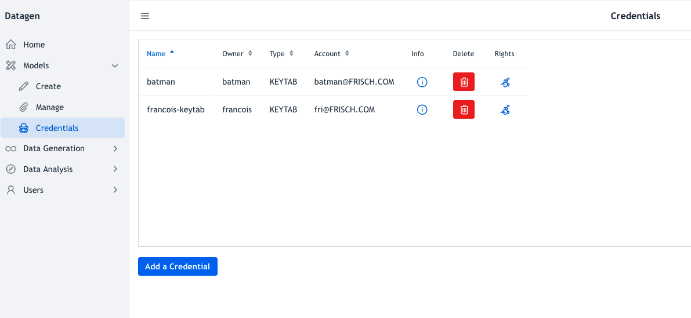

# Credentials

Sometimes credentials are required to push data to a service. 

To add, list, delete, show credentials click on _Models > Credentials_ on left panel.

It prints on main side:

Table consists of following columns:

- **Name** of the credentials 
- **Owner** 
- **Type** of the credentials
- **Account**: To which account this credentials will be associated (Optional depending on the type of credentials)
- **Info**: Prints the credentials in a pop-up in JSON format. 
- **Delete**: Delete the credentials (a pop-up ask for deletion)

At the bottom, a button **Add a Credential** allows to create a new credential.

Whatever the credential is, it is safely stored on the server on a datagen's user only-readable place, and cannot be retrieved from UI.

To create a credential, it requires:

- **Name**: Unique
- **Type**: Among: KEYTAB, KEYSTORE, TRUSTSTORE, PASSWORD, S3_ACCESS_KEY, GCP_KEY_FILE, GCP_ACCESS_TOKEN, ADLS_SAS_TOKEN
- Depending on type, it will require the associated principal (for kerberos for example) or project id for GCP etc...
- Depending on type, it will ask a value (for example for password) or to upload a file (for example for keystore)

_Note: Only an owner of a credential can delete its credentials adn manage its rights, or a Datagen admin user_
