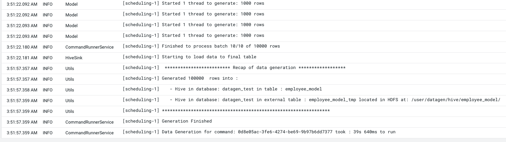
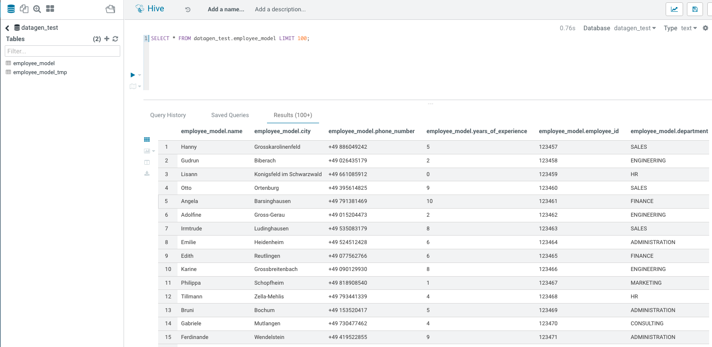

# How to create a model ?

Let's create a simple model to generate some data into Hive file:

I would like to generate something that will represent employees:

- A name
- Their location city
- Their birthdate
- Their phone number
- Years of experience in the company
- Their employee ID (in 6 digits)
- Their department (among HR, CONSULTING, FINANCE, SALES, ENGINEERING, ADMINISTRATION, MARKETING) 

And the company is based in Germany, as all employees by the way.


So here is the final JSON I outcome:

```json
{
    "Fields": [
      {
        "name": "name",
        "type": "NAME",
        "filters": ["Germany"]
      },
      {
        "name": "city",
        "type": "CITY",
        "filters": ["Germany"]
      },
      {
        "name": "phone_number",
        "type": "PHONE",
        "filters": ["Germany"]
      },
      {
        "name": "years_of_experience",
        "type": "INTEGER",
        "min": 0,
        "max": 10
      },
      {
        "name": "employee_id",
        "type": "INCREMENT_INTEGER",
        "min": 123456
      },
      {
        "name": "department",
        "type": "STRING",
        "possible_values": ["HR", "CONSULTING", "FINANCE", "SALES", "ENGINEERING", "ADMINISTRATION", "MARKETING"]
      }
    ],
    "Table_Names": {   
        "HIVE_HDFS_FILE_PATH": "/user/datagen/hive/employee_model/",
        "HIVE_DATABASE": "datagen_test",
        "HIVE_TABLE_NAME":  "employee_model",
        "HIVE_TEMPORARY_TABLE_NAME":  "employee_model_tmp"
    },
    "Options": {}
  }
```


## Test a Model

To test a model before launching a data generation, it is possible to use the API to test it.

Under model-tester-controller, an API _/model/test_ takes as input a path to a model or directly upload a model and it returns one row generated with this model.

Output is:

```json
{ "name" : "Gerhilt", "city" : "Beelen", "phone_number" : "+49 299776078", "years_of_experience" : "2", "employee_id" : "123457", "department" : "FINANCE" }
```


## Launch Data Generation

Now, we are ready, using the swagger or making direclty an API call (with curl, postman or anything else), we launch a data generation like this:

Command in the swagger:
```shell
curl -X POST "https://ccycloud-1.lisbon.root.hwx.site:4242/datagen/hive" -H  "accept: */*" -H  "Content-Type: multipart/form-data" -F "batches=10" -F "model_file=@model-test.json;type=application/json" -F "rows=10000" -F "threads=10"
```

Returns following UUID:

```json
{ "commandUuid": "1567dfba-a8f9-4da9-b389-9bc30f4ec1d5" , "error": "" }
```

In Datagen Webserver logs, we can see at the end:




Let's Verify
{: .label .label-green }

If you log into hue with enough privileges (or beeline), we have a new database: _datagen_test_ with a table _employee_model_ and some data in it:

