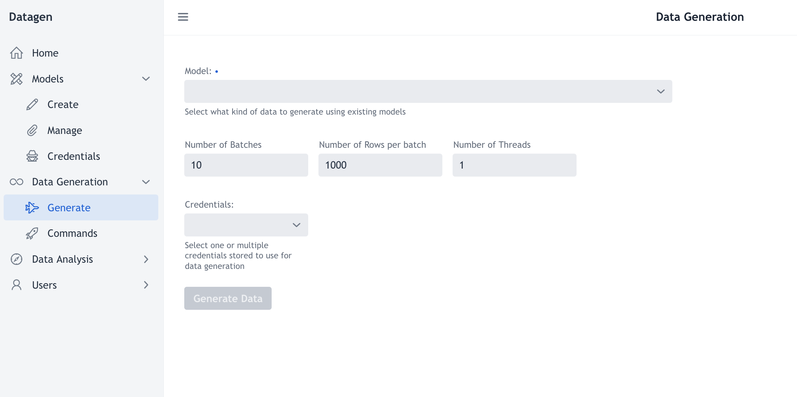
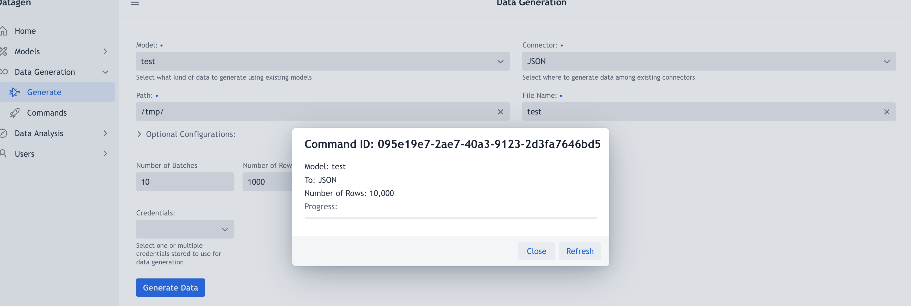

# Data Generation

To generate data, click on _Data Generation > Generate_ on left panel.

This UI should be seen:

To generate data, form must be filled:

- **Model**: Pick up a model among the ones available. 
- **Connector**: Once model has been chosen, a connector drop-down list appear. Pick up the connector where to generate data to.
- **Connectors Configuration**: Once a connector has been selected some required and optional configurations appears. To know in details, check section 'Connectors Configuration'
- **Number of Batches**: How many batches of generation to run. (By default, one batch will retain all data generated in-memory and then flushes it before going to the next)
- **Number of Rows per Batch**: How many rows to generate by batch ? (To size according to server's memory as all these rows will be retained in-memory)
- **Number of Threads**: How many threads to launch data generation in parallel ? The more you set, the faster generation should be. (To size according to server's CPU)
- **Credentials**: To add credentials of any kind that will be used to authenticate toward the connector. (So generating to AWS will require AWS access keys, toward HDFS, probably a keytab). By default, Datagen has only credentials set in its configuration file.

_Note: Total number of rows generated will be `Number of Batches * Number of Rows Per Batch`_

Finally, button **Generate Data** will create a pop-up showing that command has been well sent, a quick recap and a progress bar that needs to be refreshed with _Refresh_ Button:

This pop-up can be closed and generation can be watched in _Commands_.