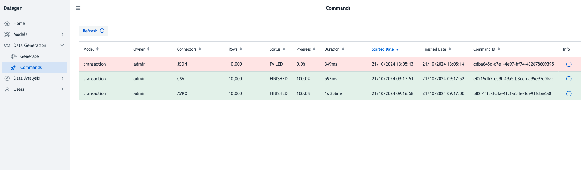

# Commands

To see past and future commands, click on _Data Generation > Commands_ on left panel.

This UI should be seen:

It is a table listing following variables:

- **Model**: Name of the model used
- **Owner**: User who launched the data generation
- **Connectors**: List of connectors where data has been sent
- **Rows**: Total number of rows to generate
- **Status**: Can be: QUEUED, STARTED, RUNNING, FAILED, FINISHED
- **Progress**: In %. It is simply the number of batches finished divided by total number of batches to make. (So a 1 batch generation is either 0 or 100%)
- **Duration**: Total duration of data generation
- **Started Date**: Date when data generation was started by datagen in _dd/MM/yyyy HH:mm:ss_ format. (It can be different than when data generation was asked).
- **Finished Date**: Date when data generation was finished by datagen in _dd/MM/yyyy HH:mm:ss_ format.
- **Command ID**: Internal ID of the command. (Can be useful for debugging and using API).
- **Info**: A button to provide more information on a command. (see below).

This table is sorted by default on _Started Date_ , but all columns are sortable.

## Information

By clicking on information, a pop-up appears showing **detailed information** on a command in JSON format.

Especially it includes details on error if there was an error in processing command.

More detailed information can then be downloaded using _Details_ button. 

This new JSON will contains **all configuration** used for data generation and **full stacktrace** of error if there was one.

In case of generating data on the local machine using one of these connectors: _CSV, AVRO, PARQUET, JSON, ORC_, a button called _Data_ is present and enables to **download data generated**.

Datagen will then look for data on the local machine, make a full zip of all files and execute the download of it.