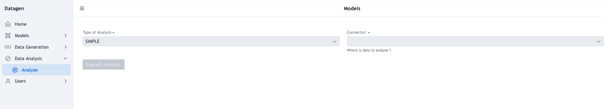

# Data Analysis

To analyze existing data to create automatically a model, click on _Data Analysis > Analyze on left panel.

This UI should be seen:

There are two first parameters in a form:

- **Type of Analysis**: Only one possibility as of now _SIMPLE_
- **Connector**: Select what kind of data to analyze among all available connectors.

Once a connector has been chosen and depending on it, other fields will appear to choose the filename or database and table etc...

Once everything is setup correctly, button _Launch Analysis_ can be pressed to **generate a model file**.

Datagen will analyze the said file or table and provide a pop-up in which the model is represented in JSON format. It then can be downloaded by using button in footer: _Download Model Generated_