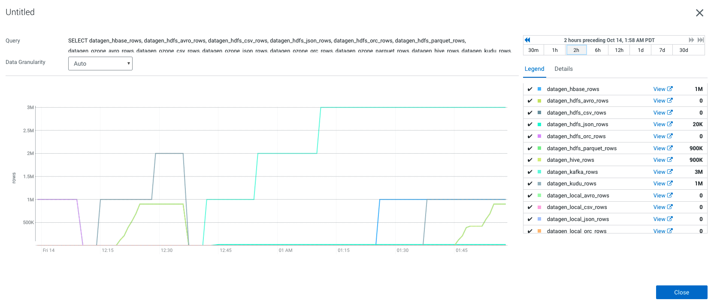

# Cloudera Manager

Cloudera Agent is gathering for us emtrics automatically from this API and feeds them into Cloudera Manager database.

Hence, in Cloudera Manager, go to Charts > Chart Builder and you can try following query:

```sql
SELECT datagen_hbase_rows, datagen_hdfs_avro_rows, datagen_hdfs_csv_rows, datagen_hdfs_json_rows, datagen_hdfs_orc_rows, datagen_hdfs_parquet_rows, datagen_ozone_avro_rows, datagen_ozone_csv_rows, datagen_ozone_json_rows, datagen_ozone_orc_rows, datagen_ozone_parquet_rows, datagen_hive_rows, datagen_kudu_rows, datagen_kafka_rows, datagen_solr_rows, datagen_local_avro_rows, datagen_local_csv_rows, datagen_local_json_rows, datagen_local_orc_rows, datagen_local_parquet_rows
```

Output will be this chart (for us):



