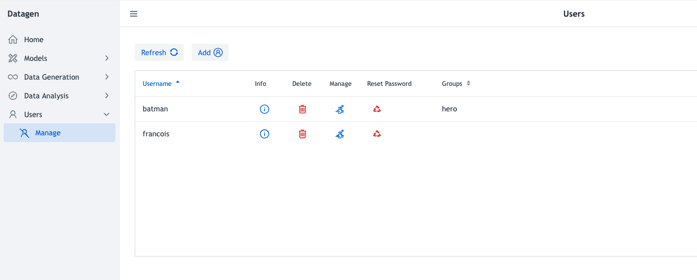

# Internal

To configure internal users, a default admin user must be set with following properties:

- **datagen.admin.user**=admin
- **datagen.admin.password**=admin

Then, automatic setup of users or groups to be admin, can be set with following properties:

- **datagen.auth.internal.group.admins**=admin : comma separated list of admin groups
- **datagen.auth.internal.user.admins**=superman,batman : comma separated list of admin users

In this mode, users are managed directly from the UI by admin users (defined above) and persisted to disk using a file whose path is defined by property:

- **datagen.users.file.path**

## User Management

To manage users: create, delete, assign or remove groups, it is made under _Users_ > _Manage_: 

To **add a new user**, press the button _Add_ and fill-in form appearing in a pop-up.

The table consists of following columns:

- **Username**: Name of the user
- **Info**: Button that open a pop-up on groups assigned to this user
- **Delete**: Button to delete this user
- **Manage**: Button to change groups assigned for this user
- **Reset Password**: Button to reset password, available for admin users and the own user
- **Groups**: List of groups that this user belongs to

_By default, table is sorted by username, but can be also filtered by groups_

_Only admin users can manage all users_

_A basic user can only reset its own password_
