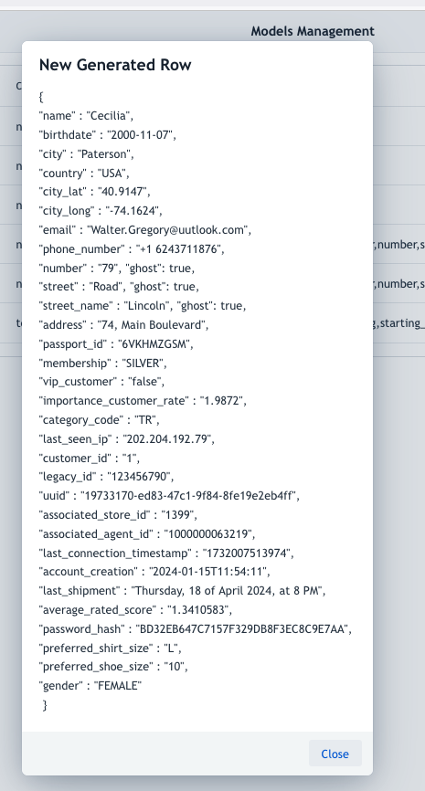
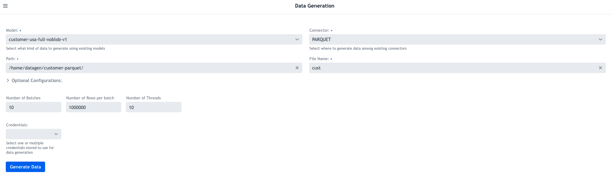
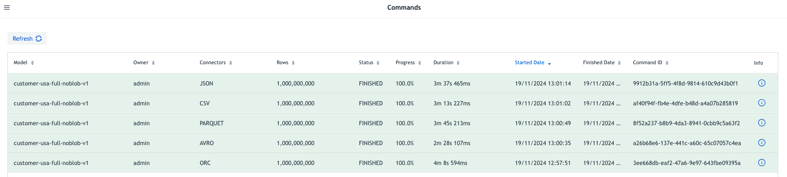

# Format Comparison

## Goal

Use Datagen to estimate your future data size and choose the best format for your data.

Use 

To achive this:

Create **1 Billion** rows of **30 columns** each, mixing string, integer, long, timestamp, bytes array generated locally in Parquet, Avro, ORC, CSV and JSON format.


## Prerequisites

Have Datagen running on a machine with enough CPU/memory (8 cores/24GB recommended) and storage (100GB recommended).

_WARNING: This will require a high usage of memory for Datagen, so set it to 24GB_


Download this model that is a mix of different columns types (string, integer, long, timestamp, boolean, bytes array) with almost 30 columns: [https://datagen-repo.s3.eu-west-3.amazonaws.com/1.0.0/models/example-full-model-noblob.json](https://datagen-repo.s3.eu-west-3.amazonaws.com/1.0.0/models/example-full-model-noblob.json) .

Making a test (by clicking on test button) should show something similar:




## Data Generation

Run first Data Generation like this:

1. Select the model: `customer-usa-full-noblob-v1`
2. Select `PARQUET` as connector
3. Put a path where datagen can write on local machine, example: `/home/datagen/customer-parquet/`
4. Put a file name, example: `cust`
5. Set `10` batches
6. Set `100000000`rows (100 million)
7. Set `100` threads 
8. Launch generation



_Note: Generation will take few minutes, if possible, parallelism and so speed can be improved by increasing threads number_


Once finished, repeat but change the path and the connector with following parameters:

1. `AVRO` with `/home/datagen/customer-avro/`
2. `ORC` with `/home/datagen/customer-orc/`
3. `JSON` with `/home/datagen/customer-json/`
4. `CSV` with `/home/datagen/customer-csv/`

Once done, commands will show something similar:




## Output 

Now, check output size of different files:

- **Parquet** files:

```shell
[root@ccycloud-1 ~]# ll -h  /home/datagen/customer-parquet/
total 1.4G
-rw-r--r-- 1 datagen datagen 135M Nov 19 05:04 cust-0000000000.parquet
-rw-r--r-- 1 datagen datagen 135M Nov 19 05:05 cust-0000000001.parquet
-rw-r--r-- 1 datagen datagen 135M Nov 19 05:05 cust-0000000002.parquet
-rw-r--r-- 1 datagen datagen 135M Nov 19 05:06 cust-0000000003.parquet
-rw-r--r-- 1 datagen datagen 135M Nov 19 05:06 cust-0000000004.parquet
-rw-r--r-- 1 datagen datagen 135M Nov 19 05:06 cust-0000000005.parquet
-rw-r--r-- 1 datagen datagen 135M Nov 19 05:07 cust-0000000006.parquet
-rw-r--r-- 1 datagen datagen 135M Nov 19 05:07 cust-0000000007.parquet
-rw-r--r-- 1 datagen datagen 135M Nov 19 05:07 cust-0000000008.parquet
-rw-r--r-- 1 datagen datagen 135M Nov 19 05:08 cust-0000000009.parquet
```

- **Avro** files:

```shell
total 2.7G
-rw-r--r-- 1 datagen datagen 275M Nov 19 05:02 cust-0000000000.avro
-rw-r--r-- 1 datagen datagen 276M Nov 19 05:02 cust-0000000001.avro
-rw-r--r-- 1 datagen datagen 276M Nov 19 05:02 cust-0000000002.avro
-rw-r--r-- 1 datagen datagen 276M Nov 19 05:03 cust-0000000003.avro
-rw-r--r-- 1 datagen datagen 276M Nov 19 05:03 cust-0000000004.avro
-rw-r--r-- 1 datagen datagen 276M Nov 19 05:03 cust-0000000005.avro
-rw-r--r-- 1 datagen datagen 276M Nov 19 05:03 cust-0000000006.avro
-rw-r--r-- 1 datagen datagen 276M Nov 19 05:03 cust-0000000007.avro
-rw-r--r-- 1 datagen datagen 276M Nov 19 05:04 cust-0000000008.avro
-rw-r--r-- 1 datagen datagen 276M Nov 19 05:04 cust-0000000009.avro
```

- **ORC** files:

```shell
[root@ccycloud-1 ~]# ll -h  /home/datagen/customer-orc/
total 901M
-rw-r--r-- 1 datagen datagen 91M Nov 19 04:58 cust-0000000000.orc
-rw-r--r-- 1 datagen datagen 91M Nov 19 04:58 cust-0000000001.orc
-rw-r--r-- 1 datagen datagen 91M Nov 19 04:59 cust-0000000002.orc
-rw-r--r-- 1 datagen datagen 91M Nov 19 04:59 cust-0000000003.orc
-rw-r--r-- 1 datagen datagen 91M Nov 19 04:59 cust-0000000004.orc
-rw-r--r-- 1 datagen datagen 91M Nov 19 05:00 cust-0000000005.orc
-rw-r--r-- 1 datagen datagen 91M Nov 19 05:00 cust-0000000006.orc
-rw-r--r-- 1 datagen datagen 91M Nov 19 05:01 cust-0000000007.orc
-rw-r--r-- 1 datagen datagen 91M Nov 19 05:01 cust-0000000008.orc
-rw-r--r-- 1 datagen datagen 91M Nov 19 05:02 cust-0000000009.orc
```

- **JSON** files:

```shell
[root@ccycloud-1 ~]# ll -h  /home/datagen/customer-json/
total 8.6G
-rw-r--r-- 1 datagen datagen 872M Nov 19 05:11 cust-0000000000.json
-rw-r--r-- 1 datagen datagen 872M Nov 19 05:12 cust-0000000001.json
-rw-r--r-- 1 datagen datagen 872M Nov 19 05:12 cust-0000000002.json
-rw-r--r-- 1 datagen datagen 872M Nov 19 05:12 cust-0000000003.json
-rw-r--r-- 1 datagen datagen 872M Nov 19 05:13 cust-0000000004.json
-rw-r--r-- 1 datagen datagen 872M Nov 19 05:13 cust-0000000005.json
-rw-r--r-- 1 datagen datagen 872M Nov 19 05:14 cust-0000000006.json
-rw-r--r-- 1 datagen datagen 872M Nov 19 05:14 cust-0000000007.json
-rw-r--r-- 1 datagen datagen 872M Nov 19 05:14 cust-0000000008.json
-rw-r--r-- 1 datagen datagen 872M Nov 19 05:15 cust-0000000009.json
```

- **CSV** files:

```shell
[root@ccycloud-1 ~]# ll -h  /home/datagen/customer-csv/
total 3.8G
-rw-r--r-- 1 datagen datagen 385M Nov 19 05:08 cust-0000000000.csv
-rw-r--r-- 1 datagen datagen 385M Nov 19 05:08 cust-0000000001.csv
-rw-r--r-- 1 datagen datagen 385M Nov 19 05:09 cust-0000000002.csv
-rw-r--r-- 1 datagen datagen 385M Nov 19 05:09 cust-0000000003.csv
-rw-r--r-- 1 datagen datagen 385M Nov 19 05:09 cust-0000000004.csv
-rw-r--r-- 1 datagen datagen 385M Nov 19 05:10 cust-0000000005.csv
-rw-r--r-- 1 datagen datagen 385M Nov 19 05:10 cust-0000000006.csv
-rw-r--r-- 1 datagen datagen 385M Nov 19 05:10 cust-0000000007.csv
-rw-r--r-- 1 datagen datagen 385M Nov 19 05:11 cust-0000000008.csv
-rw-r--r-- 1 datagen datagen 385M Nov 19 05:11 cust-0000000009.csv
```
